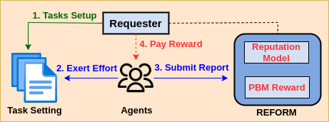

# REFORM: Iterative Fair Reward Framework for Crowdsourcing
In this paper, we study the fairness of Peer-Based Mechanisms in a crowdsourcing setting. We observe that crowdsourcing settings with PBM rewards are not fair due to random matching and can discourage agents' participation. To tackle this, we build a general framework, REFORM, that assures fairness for PBMs. REFORM provides trustworthy agents with additional chances ($\rho$) of pairing reducing the penalities agents receive from unfair-random matching. REFORM can adopt the reward scheme of any existing PBM and uses reputation models to quantify agents' trustworthiness across tasks.

{ width="800" height="600" style="display: block; margin: 0 auto" }

# Experimental Evaluation
- To demonstrate the significance of REFORM, we plug in RTPSC's reward scheme to it and we propose a reputation model PRIME to qunatity trustworthiness.
- We simulate a crowdsourcing setting to evaluate the rewards agents obtain from REFORM and RPTSC (standard PBM)
- We consider 750 agents and 1000 tasks with answer space = {0, 1, 2} in each round
- The available agents constitute 60% trustworthy, 40% random agents (other distributions can be similarly plugged-in)
- Scaling factor used in reward structure for REFORM and RPTSC is 10
- We run the experiments for $\rho = 2, 4, 6$ and observe that reward with REFORM framework are significantly fairer

# Usage
- Require Python3 environment
- Run Command: python3 simulation.py

## Code Description
- `get_rewards` runs for the simulation for given rounds computing rewards for Trustworthy agent (TA) and Random agent (RA)
- `Report` generates reports according to the agents strategies
- `Prime` computes PRIME scores for all the agents in every round
- `Sample` randomly samples reports from different tasks to compute the rewards
- `RPTSC` computes rewards for agents using RPTSC reward scheme
- `REFORM` computes rewards for agents in REFORM framework using RPTSC reward scheme
